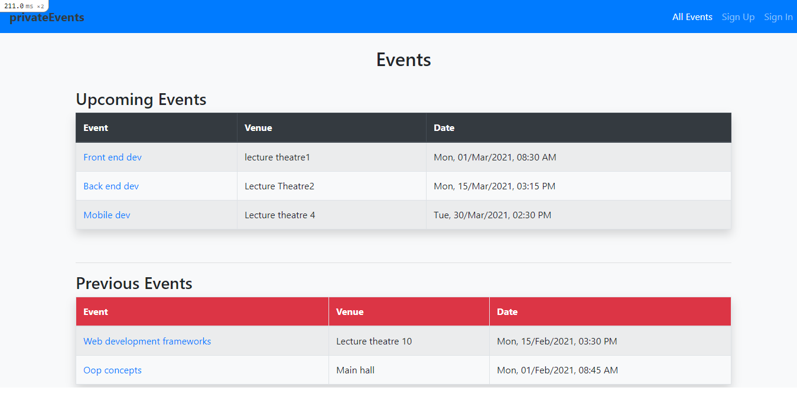

# Private Events
Private Events is a RESTful application created using Ruby on rails. It allows users to create events, invite other registered users to attend the events, and then manage user signups.

### Home Page


## Built With

- Major languages : Ruby, CSS and HTML.
- Frameworks: Ruby on Rails, Bootstrap.


## Getting started
To get started with the app:

### Clone the repo: 
```
$ git clone https://github.com/gango-anan/private-events.git

```

## Setup and run the application
### Install the needed gems:
```
$ bundle install --without production
```
### Next, migrate the database:
```
$ rails db:migrate
```
## Run Test
### Finally, run the test suite to verify that everything is working correctly:
```
$ rspec
```
### If the test suite passes, you'll be ready to run the app in a local server:
```
$ rails server
```
### In your browser URL tab, type:
```
localhost:3000
```

## Author

Galiwango Ananiya

- GitHub: [@gango-anan](https://github.com/gango-anan) 
- Twitter: [@gango_anan](https://twitter.com/gango_anan) 
- LinkedIn: [@galiwango-ananiya](https://www.linkedin.com/in/galiwango-ananiya-0800821b4/) 

## 🤝 Contributing

Contributions, issues, and feature requests are welcome!

Feel free to check the [issues page](https://github.com/gango-anan/private-events/issues).

## Show your support

Give a ⭐️ if you like this project!

## Acknowledgments

- Credit goes to TheOdinProject.


## 📝 License

This project is [MIT](https://github.com/gango-anan/private-events/blob/development/LICENSE) licensed.
